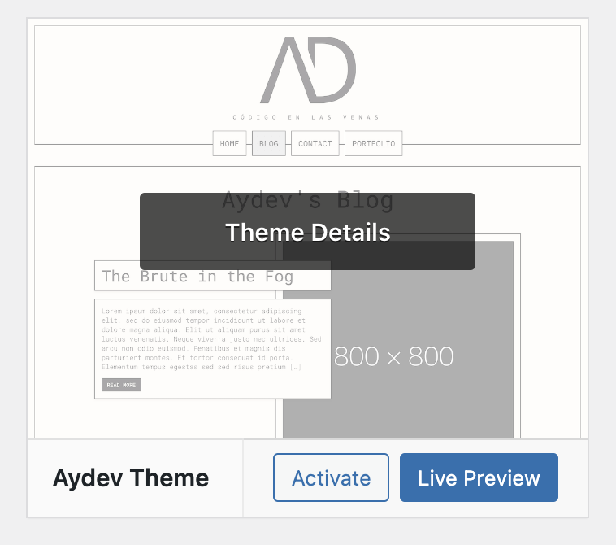
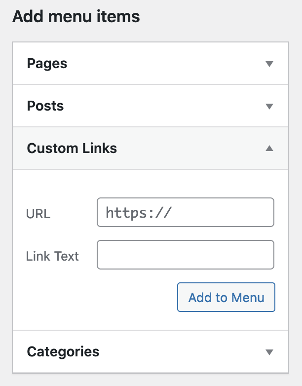

# Aydev Theme

This theme works with the latest version of [WordPress](https://wordpress.org) (at this moment: **6.0.2**)

> 💡 Before you start, you need to install [NodeJS](https://nodejs.org/en/) to compile and minify the assets.
---
## Install the theme

To install the theme in your [WordPress](https://wordpress.org), first you need to download/clone the repo, then enter to
the repo by running the command ```cd aydev-theme/```. Once you're in the folder run the following command:
```bash
docker compose exec --it web npm run prod
```

With this command we ensure to compile the CSS with the same **Node** version every time we use the container, so you don't need
to install anything else, just **docker** and that's it all the processes are handled inside the container.

---
## Developer mode

Enter the **aydev-theme**:

```bash
cd aydev-theme
```

Then copy the file ```.env.example``` and rename it to ```.env```, you can use this command to do it right in the terminal:

```bash
cp .env.example .env
```

> 💡Change the env variables as you please, but for testing purpose they're fine

Now that everything is set up just run the command ```docker compose up -d``` and just go to [localhost:8080/wp-login.php](http://localhost:8080/wp-login.php)

---
## Theme configuration
Once you're in the **admin** area go to **Appearance > Themes** and activate the **theme**.



Now we can proceed to configure the menu area with our primary menu and social media menu so don't forget to follow the instructions
to configure the theme correctly.

### Menus configuration

Simply go to **Appearance > Menus**, and then we first create the **Primary Menu** byt just giving a name and choosing the checkbox called **Primary Menu**,
and now you can add your pages/post as you want.

> 💡Stick to 4 element for the **Primary Menu**, this is because if you add more elements it could damage the UI of the theme, and generate a bad user experience. 


#### Social menu

For the social menu part, instead of using the pages/post from the site you need to add **custom links**.

For example, if you want to add **LinkedIn** simple add in the **URL** input the **URL** of your **LinkedIn** profile, and
in the **Link Text** add the text you want to display for that link.



### Static pages

Now it's time to create two pages, one for the front page (home) and another one for the blog. Once those pages are created go
to **Settings > Reading** and choose the option: **a static page**, then just select the **home page** and the **post page** (Blog).


---
### Custom logo

As a bonus you can change the logo, just go to **Appearance > Customize**, once you're in go to **Site Identity** and press ***select
logo** to select your logo image, finally just press Publish to save your changes.